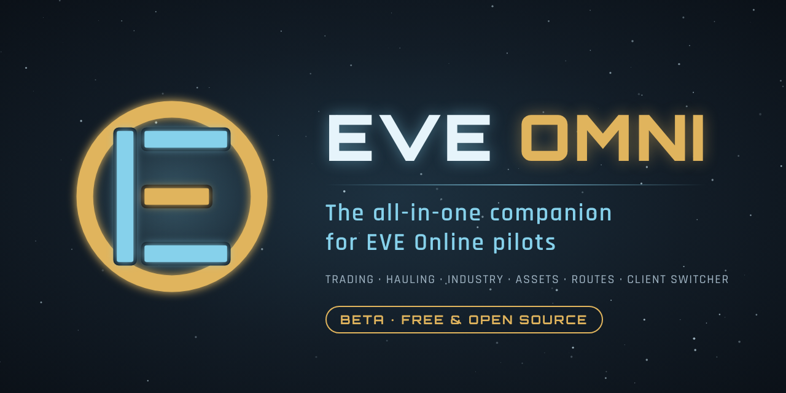
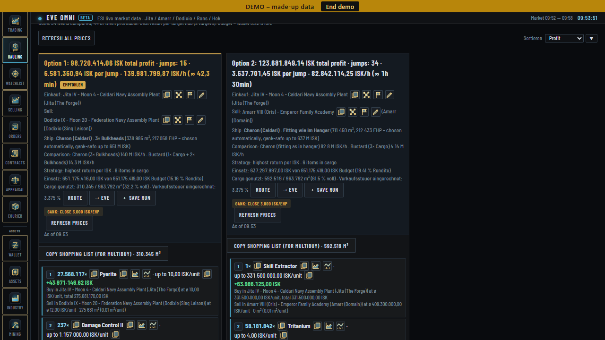
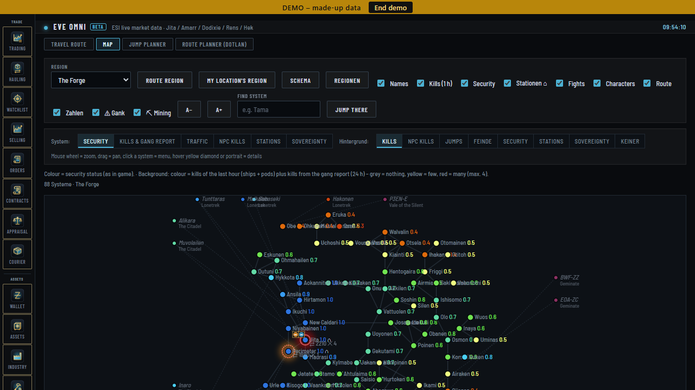
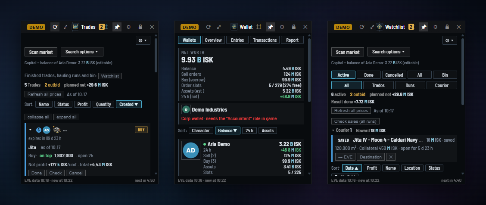

<p align="center">
  
</p>

<p align="center">
  <b>Free all-in-one desktop companion for EVE Online</b><br>
  Multi-client preview · in-game overlay · Stream Deck · market scanner · trading · hauling · industry · assets · skills · navigation
</p>

<p align="center">
  <a href="https://omni.nareya79.com">Website</a> ·
  <a href="#download">Download</a> ·
  <a href="#installation">Installation</a> ·
  <a href="#faq">FAQ</a> ·
  <a href="README.de.md">Deutsch</a>
</p>

> **Status: Beta.** The first public release is in preparation. Follow the [YouTube channel](https://www.youtube.com/@EVEOmni) to get notified.

---

## Highlights

### 🖥️ Multi-client preview – all your clients, one key
- **Live previews** of every EVE window in small always-on-top tiles – size, frame rate and position are up to you.
- **Tab through your clients** (or any key you choose), Shift+Tab goes back – in your order, character select skipped.
- **Click a preview** to bring that client to the front; a gold frame marks the active one.
- **Fair play:** one key press switches one window. EVE Omni never sends keys or clicks to the game and never repeats input across clients.

### 🪟 In-game overlay – your tools right over EVE
- Small see-through windows that float over the game – only while EVE is in front.
- Views: Trades · Watchlist · Market · Wallet · Assets · Characters · Skills · Route · Map · Local · Gang alarm · Jukebox
- One compact window or each view as its own window, snapped to the screen edge; transparency per window, lock position, auto-hide.
- One click to copy exact prices, open an item's market window in EVE or set your autopilot destination.
- Copy local with Ctrl+C and the overlay shows who is there; a live alarm pops up when hostiles are reported.

### …and everything else
| | |
|---|---|
| **Market scanner** | Profitable trades between hubs like Jita 4-4 – taxes, fees and volume included |
| **My trades & profits** | Every buy and sell from your wallet – real profit **net per unit and in total** |
| **Hauling & watchlist** | Plan runs, see what is bought, in transit or selling |
| **Orders, contracts & sell check** | Watch your orders, see when you are undercut, find the best place to sell |
| **Wallet & assets** | All characters, ISK, journal and items in every station |
| **Industry & blueprints** | Jobs, blueprints and planetary industry |
| **Skills** | Skill queue and trading skills – fees are calculated from your real skills |
| **Navigation & map** | Route planner, jump planner, map, autopilot destination in one click |
| **Intel & local report** | Paste local, see who is around with killboard info |
| **Gang alarm & report** | Live killboard alerts in a “Hostile reported” window |
| **Multi-character & settings sync** | All characters at once, copy EVE client settings between them |
| **Soundtrack** | The EVE Omni soundtrack by Nareya79 is built in |
| **Stream Deck & Stream Dock** | Plugin for Elgato Stream Deck (incl. Stream Deck +) and MiraBox Stream Dock (N4 & co.) – overlay keys, live values, timer, jukebox, dials |

All values you type into EVE come with a copy button.

<p align="center">
  
  
</p>
<p align="center">
  
</p>

---

## Download

The first public beta is coming soon. It will be available on the [Releases page](../../releases):

| File | |
|---|---|
| `EVE-Omni-Setup-<version>.exe` | Installer (no admin rights needed) |
| `EVE-Omni-<version>-portable.zip` | Portable version, no installation |
| `EVE-Omni-Soundtrack.zip` | Music |
| `SHA256SUMS.txt` | Checksums to verify your download |

Requirements: Windows 10/11, 64-bit. A browser version (single HTML file) is included for other systems, with some limits.

## Installation

1. **Download** `EVE-Omni-Setup-<version>.exe` from the Releases page.
2. **Start the installer.** If Windows shows *“Windows protected your PC”*, click **More info → Run anyway**.
   > Why? EVE Omni is a free hobby project and is not code-signed (a certificate costs money every year). Every release lists SHA256 checksums and a VirusTotal scan so you can verify the file.
3. **Log in with EVE** – click “Log in with EVE”, pick your character on CCP's login page and confirm. Add more characters any time.
4. **Fly.** Pick your trade hub, open the market scanner and go. o7

No developer account and no API keys needed.

---

## Safety & privacy

- **Official EVE login only.** You log in on CCP's own page (EVE SSO with PKCE). EVE Omni never sees your password.
- **Your data stays on your PC.** Logins, trades and settings are stored locally only – no account, no cloud, no tracking.
- **No automation.** EVE Omni does not read or change game memory and never sends input to the game.
- **Network access:** CCP's ESI (your data and public market data), zKillboard and DOTLAN (public data), and one update check per day on GitHub (can be turned off). Nothing is sent to the developer.

### Why does the login ask for these permissions?
Each area of the app needs read access to its own data. Only two permissions can *do* something in the game, and only when you click the button: setting an autopilot destination and opening an info/market window.

| Area | ESI scopes |
|---|---|
| Skills & fees | `esi-skills.read_skills.v1`, `esi-skills.read_skillqueue.v1`, `esi-characters.read_standings.v1` |
| Wallet & profits | `esi-wallet.read_character_wallet.v1`, `esi-wallet.read_corporation_wallets.v1`, `esi-corporations.read_divisions.v1` |
| Assets & structures | `esi-assets.read_assets.v1`, `esi-universe.read_structures.v1` |
| Orders & contracts | `esi-markets.read_character_orders.v1`, `esi-contracts.read_character_contracts.v1`, `esi-contracts.read_corporation_contracts.v1` |
| Industry, blueprints, mining, PI | `esi-industry.read_character_jobs.v1`, `esi-characters.read_blueprints.v1`, `esi-industry.read_character_mining.v1`, `esi-industry.read_corporation_mining.v1`, `esi-planets.manage_planets.v1` (read only) |
| Characters | `esi-location.read_location.v1`, `esi-location.read_online.v1`, `esi-location.read_ship_type.v1`, `esi-clones.read_clones.v1`, `esi-clones.read_implants.v1`, `esi-characters.read_contacts.v1` |
| In-game actions (on click only) | `esi-ui.write_waypoint.v1`, `esi-ui.open_window.v1` |

---

## FAQ

**Is EVE Omni allowed by CCP?**
It uses only CCP's official public interfaces (ESI and EVE SSO), like other third-party tools. It never reads or changes game memory and never sends keyboard or mouse input to the game. The client switcher only brings an EVE window to the front – one key, one window.

**Does it cost anything?**
No. Free, with every feature, forever – no premium version.

**I found a bug / have an idea.**
Open an [issue](../../issues) (please include your EVE Omni version and Windows version). **Never post login tokens or codes.**

---

## Support EVE Omni

EVE Omni is free. If it helps you, an in-game ISK donation to **Nareya Mythec** is very welcome – no real money, no premium, no pressure.
*In EVE: search the name → right-click → “Give Money”.*

## Build from source

The app is `EVE-Omni.html` plus the Electron shell in `Programm-Quellcode/src/`. `build.js` builds the Windows folder from the official Electron 64-bit ZIP (checksum verified); `tools/installer.iss` is the Inno Setup script for the installer.

```
cd Programm-Quellcode/src && npm install          # koffi
cd .. && npm install resedit@3.1.0
node build.js <electron-win32-x64> <output folder>
```

## License

- **Code:** [MIT License](LICENSE)
- **Soundtrack** (`soundtrack/`, 23 tracks): © 2026 Nareya79 – own license, see `soundtrack/LICENSE`. In short: listen to it and use it in your own videos and streams, also monetized, with credit (*Music: EVE Omni Soundtrack by Nareya79 – omni.nareya79.com*). Not allowed: selling, uploading to music platforms, Content ID.

## Legal

EVE Omni is a fan project by Nareya79 and is not affiliated with or endorsed by CCP hf.
© CCP hf. All rights reserved. “EVE”, “EVE Online”, “CCP”, and all related logos and images are trademarks or registered trademarks of CCP hf.

[Website](https://omni.nareya79.com) · [Legal notice / Impressum](https://omni.nareya79.com/impressum.html) · [Privacy](https://omni.nareya79.com/datenschutz.html)
